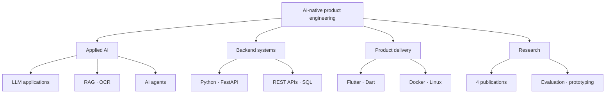

  

<h1 align="center">Pedro Antonio Ibarra Facio</h1>

  <strong>Applied AI & Backend Developer</strong> 
  Python · FastAPI · LLM Applications · RAG/OCR · Flutter

  
  

<em>Discipline to build. Curiosity to explore.</em>

---

## Player profile

I build AI-enabled backend and mobile products with **Python, FastAPI, Flutter, Docker, LLMs, and RAG**. My workflow is AI-native: I use modern models to accelerate implementation while owning requirements, architecture, verification, deployment, and ongoing support.

I am completing a **B.Eng. in Computer Intelligence Engineering** at the University of Colima (expected February 2027) while working across private production software, applied AI research, and teaching support.

- Based in Colima, Mexico · UTC−6
- Spanish: native · English: CEFR B2
- Interested in applied AI, backend engineering, local-first systems, and thoughtful product development
- Open to remote internships, contract work, and junior roles with US and LATAM teams

## Progress snapshot

| Academic record | Academic excellence | Research output | SmartReview validation |
|:---:|:---:|:---:|:---:|
| **9.67/10 GPA** | **2 scholarships** | **4 publications** 2 first-author | **25 papers** 443 pages |

## Mission log

| Field mission | Result |
|---|---|
| **Private production systems** | Build and maintain two applications for private clients, covering discovery, architecture, backend and mobile implementation, deployment, and support. |
| **SmartReview** | Developed a privacy-oriented local RAG/OCR workflow with an average processing time of **4.1 seconds per page** and an approximate **28.5× reduction** in LLM context size. |
| **In Situ Lab** | Contributed to a cross-platform, offline-first fieldwork application shipped to the **Apple App Store**. |
| **I2T2 research program** | Built a QR-enabled mobile asset-management solution during the 2026 International Summer Research Program in collaboration with Schneider Electric. |
| **Applied AI research** | Authored or co-authored four academic publications on LLM applications, RAG, scientific review, education, and decision-support systems. |

## Core disciplines

| Applied AI | Backend systems |
|---|---|
| LLM applications · RAG · OCR · AI agents · retrieval evaluation | Python · FastAPI · REST APIs · SQL · system integration |
| **Product engineering** | **Research & teaching** |
| Flutter · Dart · Docker · Linux · deployment · support | Evaluation · prototyping · academic writing · technical instruction |

<strong>Open the technique map</strong>

## Research archive

- **Four academic publications**, including two as first author
- Research presentations at **CITCA 2024** and **CIREDII 2025**
- Research & Teaching Assistant at FIME, University of Colima
- Participant in the **2026 I2T2 International Summer Research Program** at PIIT
- Acknowledged reviewer for Manning's *Learn AI-Assisted Python Programming with GitHub Copilot and ChatGPT*

<strong>Open the publication scrolls</strong>

- **Towards Personalized Education: Implementing Large Language Models and RAG for Active Learning** — first author
- **SmartReview: Locally-Assisted Intelligent Scientific Literature Review** — first author
- **Automated Generation of Educational Content from Teaching-Learning Records: A Literature Review and Architectural Proposal** — co-author
- **Conceptual Architecture for Personalized Blood Glucose and Medication Dosage Prediction** — co-author

<strong>Open the recognition log</strong>

- **Two-time Academic Excellence Scholarship recipient** — University of Colima, 2023–2024 and 2025–2026 periods
- **Conversational AI workshop facilitator** — delivered a 15-hour course on building chatbots with generative AI at TecnoFIME 2024
- **Robotics workshop instructor** — led a robotic-arm demonstration for young students during the 2025 Engineering Week
- **International research program participant** — I2T2 at PIIT, July 2026

## Current training

I am especially curious about:

- Reliable RAG and retrieval evaluation
- Local-first and privacy-aware AI systems
- Agentic workflows with practical safeguards
- Multimodal AI and document intelligence
- Turning research prototypes into maintainable products

## Beyond the terminal

Anime, manhua, manhwa, martial-arts visual storytelling, and following the evolution of AI. I like systems with clear progression: learn the fundamentals, test them in practice, and keep refining the craft.

---

  <strong>Open to building useful systems at the intersection of AI, backend engineering, and curiosity.</strong>

